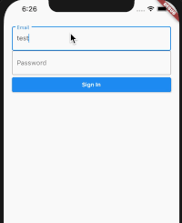
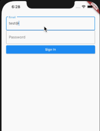
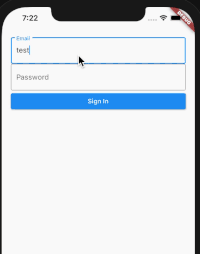
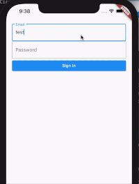

# dialog_loader

This package will make it easier to create a loader.


## New Features 💥
****
- The barrierDismissible default set to false on loading and will be automatically set to true when the load is complete.
- Asset file / Image network support on the loader.
  
## Installation
Include dialog_loader in your pubspec.yaml file:

```yaml
dependencies:
  flutter:
    sdk: flutter
  dialog_loader: version
```

Now in your Dart code, you can use:

```dart
import 'package:dialog_loader/dialog_loader.dart';
```
## Preview


 LoaderTheme.dialogDefault         |  LoaderTheme.dialogCircle
:-------------------------:|:-------------------------:
 | 

 LoaderTheme.dialogDefault (left and right icon)         |  LoaderTheme.dialogCircle (Image network)
:-------------------------:|:-------------------------:
 | 

**with the dialog loader package, you can easily combine with popular state management on handling state updating, like loading, error, and success state.**
## Usage
****
[You can review the example of usage from the Github repo.](https://github.com/sud0su/dialog_loader/tree/main/example/)

Create a new instance, pass the context as parameter.

```dart
  @override
  Widget build(BuildContext context) {
    DialogLoader dialogLoader = DialogLoader(context: context);
```

Create the default option of the loader
```dart
_dialogLoader(context) async {
      dialogLoader.show(
        theme: LoaderTheme.dialogCircle,
        title: Text("Loading"),
        leftIcon: SizedBox(
          child: CircularProgressIndicator(),
          height: 25.0,
          width: 25.0,
        ),
      );
    }

```

You don't need to update state, just pass the value.
```dart
void _update() {
      _dialogLoader(context);
      Future.delayed(const Duration(seconds: 4), () {
        dialogLoader.update(
          title: Text("Done"),
          leftIcon: Icon(Icons.done),
          autoClose: false,
          barrierDismissible: true,
        );
      });
    }
```


### Constructor
|  Name | Description   | Required   | Default   |
| ------------ | ------------ | ------------ | ------------ |
| context  | Buildcontext to render the dialog | True   |   |

### Properties
|  Name | Description   | Required   | Default   |
| ------------ | ------------ | ------------ | ------------ |
| theme  | Loader theme | False   | LoaderTheme.dialogDefault,  |
| title  | Dialog title |  False  |   |
| leftIcon  | Icon on the left side of the loader, and at the top for dialogCircle theme | False   |  |
| rightIcon  | Icon on the right side of the loader | False   |  |
| barrierColor  | Barrier Color of the loader| False   | Colors.black26 |
| borderRadius  | Double value to indicate the dialog border radius | False   |  5.0 |
| backgroundColor  | Double value to indicate the dialog background color | False   | Colors.white  |
| elevation  |  Double value to indicate the elevation border | False   | 5.0  |
| autoClose  |  Boolean value to indicate auto Close the loader when the processing is complete | False   | true  |
| barrierDismissible  |  Boolean value to indicate barrierDimisable on dialog | False   | false  |

